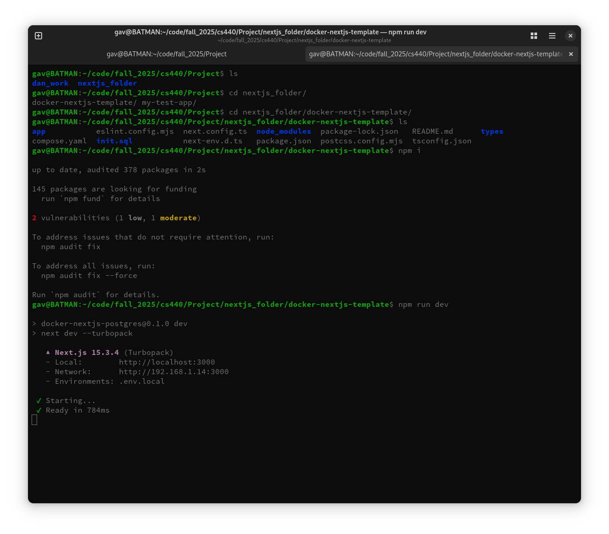
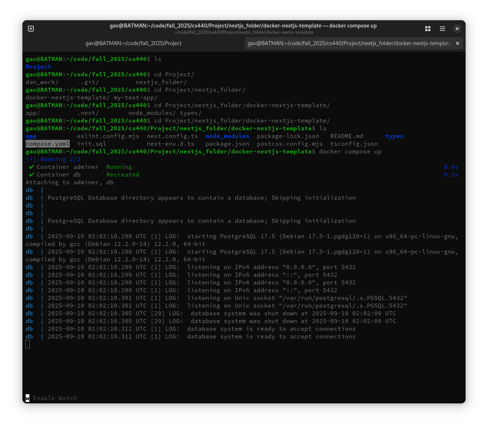
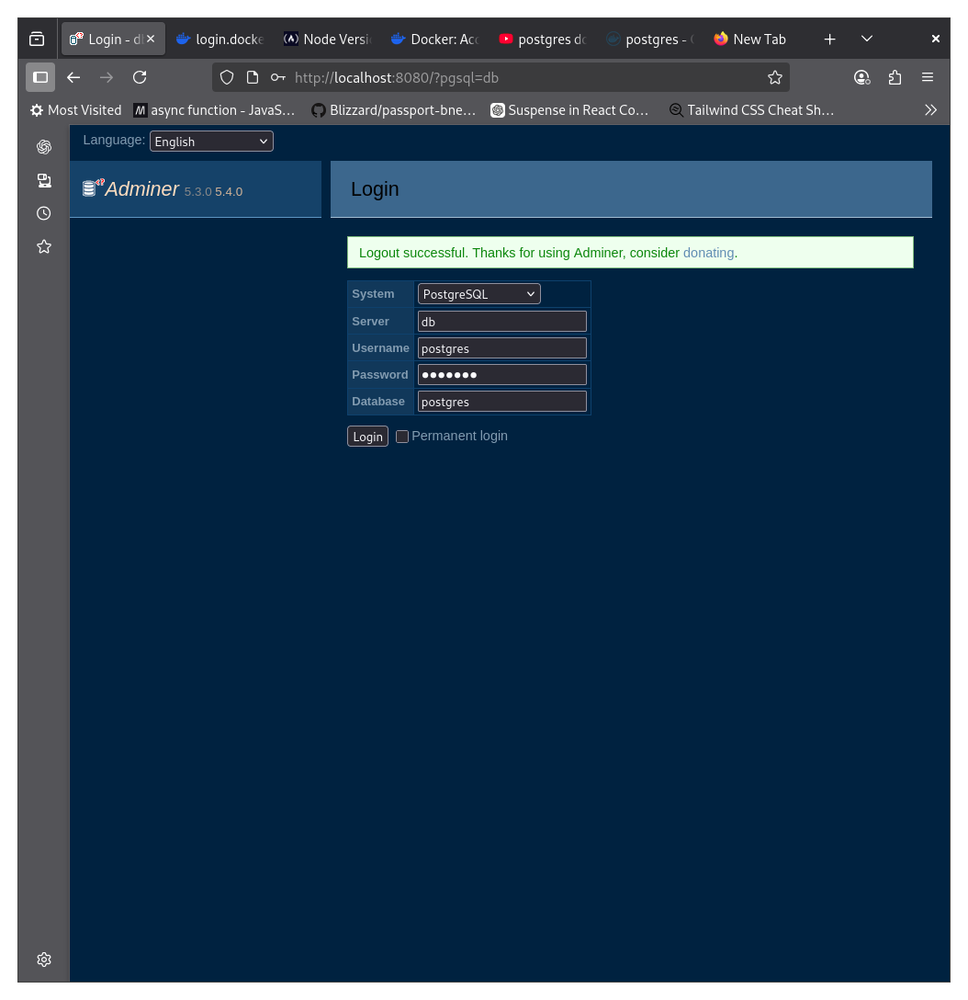

# **This file will guide you through installing dependencies, running a docker container and adding to the database.**

#### **As a pre-requisite ensure you have npm (node package manager) available or install with [nodejs](https://nodejs.org/en/download)**

## 1. Accessing the git branch, installing npm dependencies and running the nextjs server without docker-postgres running

- Ensure you have npm installed in terminal run: `npm -v` otherwise install npm by installing [nodejs](https://nodejs.org/en/download)
- Open your terminal and in the Projects git repo or folder checkout to gavins_branch `git checkout gavins_branch`
- There should be a folder named nextjs_folder, in your terminal change directory to **docker-nextjs-template**
- **Run the command `npm i` npm dependencies should install and subsequently you should see npm saying it installed many dependencies**
- _You might need to run the command "Set-ExecutionPolicy -ExecutionPolicy Unrestricted" to allow the script to run._
- Run the nextjs server to test to see if it works! `npm run dev`

- Open your browser and visit it at `localhost:3000/` but it may break due to the database not being active (The next section covers this).

## 2. Run the docker container:

- Install docker/docker desktop [docker.com](https://www.docker.com/)

- After installing docker and **ensuring docker is running**, open your terminal and go to the directory: `Project/nextjs_folder/docker-nextjs-template` (shown below)

- Run the command `docker compose up` if everything worked and it says the database is ready to accept connections: SUCCESS, and you can move onto #3 or learn to stop/kill the docker container(s) (below).

- If you do run into error message I reccomend pasting the error message into chat-gpt or look online

- tear down the container: `docker compose down`

- verify its torn down: `docker ps`

- if container(s) are still running: `docker kill db adminer`

## 3. Verify the docker containers are working

- Restart the containers if they are not already up and running, ensure they are running by `docker ps` you should see **postgres** and **adminer** as the two containers running

- Visit `localhost:8080/` in your browser and enter these credentials:

      System: PostgreSQL
      Server: db
      Username: postgres
      Password: test123
      Database: postgres

- Hit the Login button and it should take you to a screen where you can explore the tables in the db mainly the **users** table.

## 4. Now that everything is setup explore the code a little bit, that being said not much there yet

- In the directory nextjs-folder/docker-nextjs-template `docker compose up -d` then `npm run dev`

- I recommend creating a user in the users table in adminer(localhost:8080/) and using the user you've created to try logging in on the frontend and exploring the code behind how logging in works in terms of frontend to database interactions

## 5. Some notes about the file structure:

- docker-nextjs-template: contains the entire nextjs and docker-postgres app

- /app: this folder is unique in that each directory can have a page.tsx meaning a folder structure under app such as:

      /app
        |_ /home
        |     |_ page.tsx
        |
        |_ layout.tsx
        |_ page.tsx

- Means that localhost:3000/ will open the page.tsx under /app this also means localhost:3000/home will open the page.tsx in the /home directory

- layout.tsx: is the root file that houses the entire html js css frontend, notice how it is the only place where \<html\> and \<body\> tags exist. This file substitutes out what page.tsx is shown in place of { children } in the layout.tsx file.

  #### Removing Postgresql Docker image volume
* The goal is to remove the current docker container's saved volume. This volume is the home for the data saved in our database.
* Clearing the volume will allow init.sql to initalize the database again.
##### Process for removing postgres's volume 
  1. Ensure docker is up and running. Along with making sure the image is turned off ( `docker compose down` or `docker kill <image_name/image_id>` ) 
  3. run: `docker volume ls` this will show you what volumes are created already
  4. run: `docker volume rm docker-nextjs-template_pgdata` this will delete the volume named docker-nextjs-template_pgdata
  5. Start up the postgres image again: `docker compose up` without -d you can see any errors thrown by the image container in the terminal.

